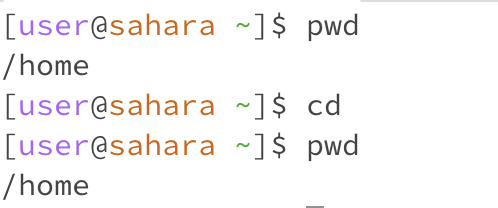
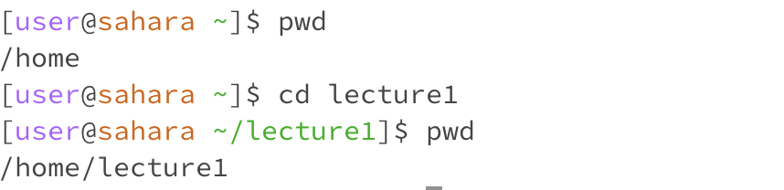
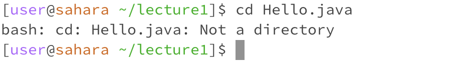
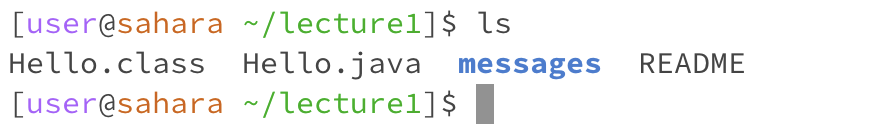
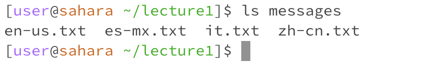
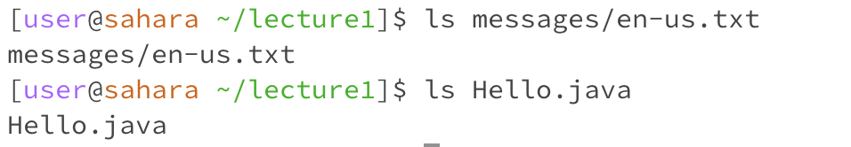
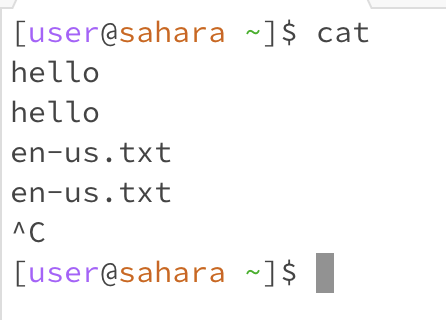
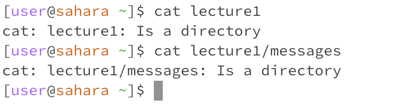
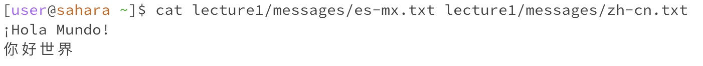

# Week 1: Markdown, Filesystem & Paths
## 1/11 Lab 1 Blog
### Commands
1. `cd`: changes the current working directory to the path specified.
   * No arguments:\
     \
     When `cd` is invoked without an argument, no new directory is given so no working directory switch occurs. Therefore, because the working directory was `/home` when the command was run, it's still `/home` after. This is the command's expected behavior and not an error.
   * Directory path as an argument:\
     \
     Here a directory is specifed. Again, `cd` executess without error. All  The folder `/lecture1` exists inside `/home` so invoking the command `cd` changes the working directory from `/home` to `/home/lecture1`.
   * File path as an argument:\
     \
     When a file path is passed as an argument, then an error occurs. Here, the file **Hello.java** exists inside the working directory **/home/lecture1**, but when the path is passed to `cd`, a message pops up indicating that the path specified is not a directory. This is because the working directory can only be, well, a directory. `cd` can only be run from a directory to switch to other directories that are nested within it.
     
2. `ls`: lists out the files in folder at the specified path
   * No arguments:\
     \
     When no path is passed as an argument, the command `ls` executes without error by printing to the terminal the list of files and directories under the current working directory. The current working directory **/home/lecture1** contains the files `Hello.class`, `Hello.java`, `README`, and the directory/folder `messages`, which is what's printed in the terminal.
   * Directory path as an argument:\
     \
     When `ls` is executed with a specified command, the code lists the files under the specified path without error. Here the path to an existing directory, **home/lecture1/messages**, is passed as an argument. In this case, `ls` prints the files and directories that are inside the specifed path, which are `en-us.txt`, `es-mx.txt`, `cn-zh.txt`, `it.txt`.
   * File path as an argument:\
     \
     When file paths are passed as arguments to `ls`, the path is merely reprinted to the terminal. The example shows two examples of this occuring. Above there are two examples where this occurs: rom the current working directory `/home`, the path `/home/lecture1/messages/en-us.txt` and `/home/lecture1/Hello.java` are merely reprinted to the terminal. I'm guessing that this is because files can be thought of the end of a "branch" in the filesystem "tree" - there is nothing nested in them, so the file is just printed back out in the terminal. This does not seem to be an error, but unlike when `ls` is used on a directory, it returns the file path as an absolute url.
3. `cat`: concatenate, prints the contents of the file(s) at the specified path(s) to the terminal
   * No arguments:\
     \
     Without a specified file path, `cat` continues running, expecting a file to be passed. Anything I subsequently type is copied again to the terminal. `ctrl+C` must be applied to end the program. This is an error, because an infinite loop is created. In the example above, `cat` is run from the home directory.
   * Directory path as an argument:\
     \
     When a directory path is passed as an argument, then an error is thrown -- a message is printed to the terminal indicating that the path "Is a directory". Above, I tested this on the `lecture1` directory, which exists in `home`, and the `messages` directory which is nested in `lecture1`. This is because `cat` only prints the contents of files.
   * File path as an argument:\
     \
     Here, the `cat` command is finally being properly used. From the working directory `/home`, I gave the relative paths of two existing text files `es-mx.txt` and `zh-cn.txt` within the filesystem under `home`. The contents of both files are printed to the terminal. Multiple paths can be given, and `cat` will print all the contents to the terminal as long as the file exists. This is not exclusive to text files but also code files and more.
