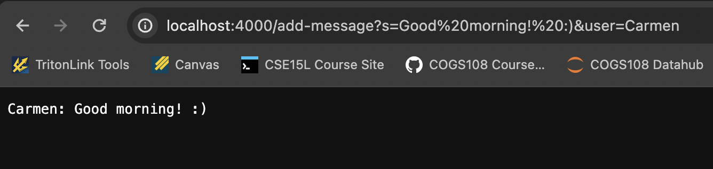
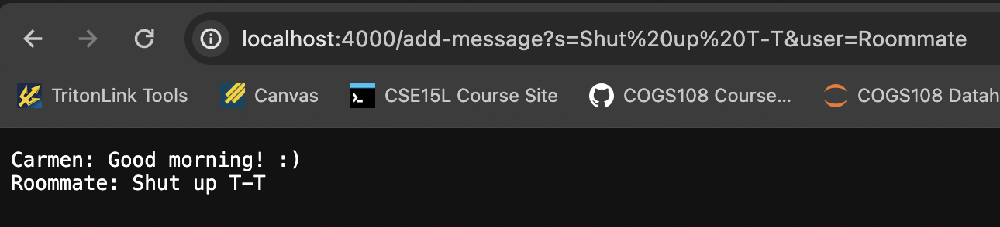
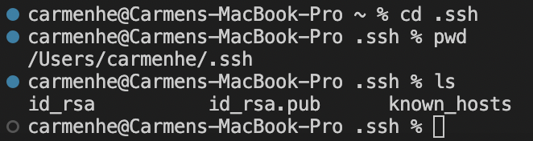
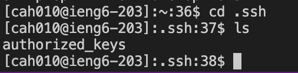
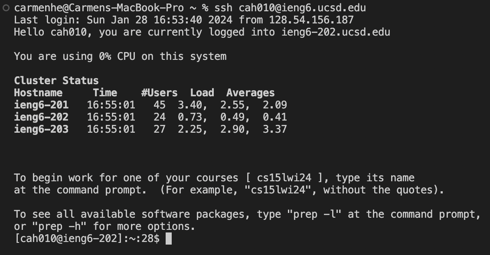

# Week 3: URLs, Servers, and SSH Keys
## 1/25 Lab Report 2
### Part 1
#### ChatServer Code
```
import java.io.IOException;
import java.net.URI;

class Handler implements URLHandler{
    //A String state that requests are copied to
    String messages = "";

    public String handleRequest(URI url){

        if(url.getPath().equals("/")){

            return messages;
            
        } else if(url.getPath().equals("/add-message")){


            String[] parameters = url.getQuery().split("[=&]");
            if(parameters[0].equals("s") && parameters[2].equals("user")){
                messages += String.format("%1$s: %2$s\n",parameters[3],parameters[1]);
                return messages;
            }

        }
        return "404 Not Found!";
    }

}

class ChatServer{
    public static void main(String[] args) throws IOException{
        if (args.length == 0){
            System.out.println("Missing port number!");
            return;
        }

        int port = Integer.parseInt(args[0]);

        Server.start(port, new Handler());
    }
}
```
#### ChatServer Demo
1. To set up the web server and port, first I compiled my code files and then ran `ChatServer.java` from the terminal specifying the port number `4000`. This creates a call tothe main method in the `ChatServer` class, which takes arguments of the type `String[]` (so the port number is read as a string and converted to an integer). The main method starts a server under the given port number and creates a new instance of the Handler class to read the URLs.
   In the image above, I added the path and queries `/add-message?s=Good morning!:)&user=Carmen`, which is reformated to have "`%20`" to fill the spaces in the strings assigned to the queries. The complete url is passed as an argument into the `handleRequest` method,which accepts arguments of the type `URI`, of the `Handler` object. The `if` statements use the imported function `URI.getPath()` to isolate the path from the url and compare it; in thiscase, the path is `/add-message`, so the second condition in the `if-else` statement block in the `handleRequest` method evaluates to true. This updates the `messages` string field in the `Handler` class, which is initially empty, and displays it to the webpage. We see that `messages` now reads `Carmen: Good morning! :)` just as expected.\
   
   

2. In the image below, I entered another url with the path `/add-message`, but with the new query `?s=Shut up T-T&user=Roommate`. Again, the complete url, of type `URI`, is passed as anargument into the `handleRequest` method of the `Handler` object. Again, the second conditional `url.getPath().equals("/add-message")` evaluates to true. Hence, the String field `messages` is updated again to include the string parameters from the new query and returned to the webpage. Now, we see that messages is `messages = "Carmen: Good morning! :)\nRoommate: Shut up T-T"`. This output follow expected behavior.\
   
   
   
### Part 2
#### SSH Keys


- Absolute path to private SSH key on my local computer: `/Users/carmenhe/.ssh/id_rsa`



- Absolute path to public SSH key on the remote server: ``

#### Remote Server Login
No password needed!


### Part 3
First of all, I didn’t know that it was possible to connect to a remote server from a local machineuntil lab in Week 2. It was really cool to learn how to do this, and perform all kinds ofmanipulations across these servers: I particularly enjoyed learning how to transfer files across twodifferent servers. Addtionally, I learned a lot about how to read urls over these past two weeks. Now I know the meaning of many symbols and can identify the different parts of a url, whenpreviously they were indecipherable gibberish to me.
