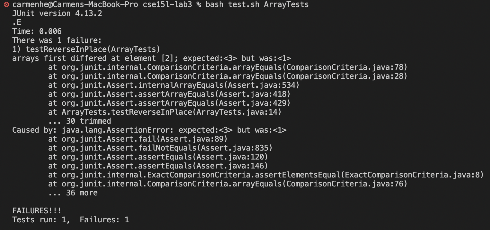

# Debugging, File Exploration, and Text Analysis

## 2/13 Lab Report 3

### Part 1: Bugs
Last week, I stepped through the process of indentifying and isolating progam bugs.  
<br/>For the `ArrayExamples` class, I used `JUnit` tests to check for buggy methods. Let's look at one example.
> 🔄 **Buggy Method:** `reverseInPlace(int[] arr)`
> **JUnit Tests**
> ```
> @Test
> public voide testReverseInPlace() {
>    // failure-inducing input
>    int[] fails = {3,2,1};
>    assertArrayEquals(new int[]{1,2,3}, ArrayExamples.reverseInPlace(fails));
>
>    // asymptomatic input
>    int[] passes = {3,3,3};
>    assertArrayEquals(new int[]{3,3,3}, input1);
> }
> ```
> 
> **Symptom**
>   
> From the output after running my tests, it appears that the failure-inducing input, the arraay `fails`, is not reversing as expected.
> 
> **The Bug**
> - Before fix:
>   ```
>   // Changes the input array to be in reversed order
>   static void reverseInPlace(int[] arr) {
>       for(int i = 0; i < arr.length; i += 1) {
>           arr[i] = arr[arr.length - i - 1];
>       }
>   }
>   ```
>   The current issue is that the original value at each position is updated without being retained, so when we reach the later half of the list, the values aren’t being changed
> - After fix:
>   ```
>   // Changes the input array to be in reversed order
>   static void reverseInPlace(int[] arr) {
>       int replaced;
>       for(int i = 0; i < arr.length/2; i += 1) {
>           replaced = arr[i];
>           arr[i] = arr[arr.length - i - 1];
>           arr[arr.length - i - 1] = replaced;
>       }
>   }
>   ```
>   To fix the bug, I created a new variable called `replaced` to store the value being replaced, so it’s not being overwritten. Then I only need to iterate through half of the list so the elements in the latter half of the list are updated with the value stored in the `replaced`.

### Part 2: Researching Commands

**The `grep` command**
Recall that at it's simplest form, the `grep` command takes a String pattern and file path and prints out all the lines in the file that contain the pattern.  
`grep [options] "pattern" /file path/`  

<br/>**Options**
1. `-r` Recursively searches through the specified directory the given String pattern.
   Syntax: `grep - r "pattern" /directory path/`  
   
   For each file that has the pattern in the entire directory, lines that contain the matches are printed out. This is helpful because sometimes we want to identify occurences of a target pattern in an entire directroy of related files instead of merely one file. In the example below, I search for occurences of the string "base pair" in the directory `technical/plos` and find 3 matches.
   ```
   $ grep -r "base pair" technical/plos
   technical/plos/journal.pbio.0020223.txt:        Watson-Crick base pairing, the proximity of the synthetic reactive groups elevates their
   technical/plos/journal.pbio.0020190.txt:        sequence, which is a specific series of eight base pairs in the DNA of the bacterial
   technical/plos/journal.pbio.0020190.txt:        chromosomes, on the order of one or two thousand base pairs of DNA (or less) their length is
   ```
   Additionally, I can combine this with other commands, such as `wc`, to count the total number of matches, and specify the file type in the directory pattern. This is something we can do with all `grep` commands. The example shows that 226 lines within the text files in technical/biomed contain a match.
   ```
   $ grep -r "base pair" technical/biomed/*.txt | wc
   226    2326   22534
   ```
   _Source: Chat_GPT_
       - Prompt: How does grep -r work and how can it be used to explore files?
       - Output: Provided the user manual definition of `-r` in context of `grep`, and 6 conceptual applications of `grep -r` with syntax. I included the definitions above, translated into my own words, and created my own examples with a newfound understanding of how to apply `grep -r`.
  
2. `-l`: Limits the output to a list of the files in the specified file path that contain a match of the pattern.
   Syntax: `grep - l "pattern" /file path/`

   When I use the expansion file path, all relevant files names containing the pattern are printed. This is very useful for when we want to see which specific files discuss a topic of interest. In the example below, I search for the pattern "base pair" among text files in the directory `technical/plos`. Because the command only takes a file path, the `*` expansion allows us to search through all the text files in the directory.
   ```
   $ grep -l "base pair" technical/plos/*.txt
   technical/plos/journal.pbio.0020190.txt
   technical/plos/journal.pbio.0020223.txt
   ```

   When a specific file path is specified, if it contains a match, it is the only file printed. If it doesn't match, nothing is printed. In the example below, `grep -l` is applied to a specific file path. The file path is printed onto the terminal, which indicates that it does contain the pattern "base pair". This is useful for checking whether a single file contains a specific topic or not.
   ```
   $ grep -l "base pair" technical/plos/journal.pbio.0020190.txt
   technical/plos/journal.pbio.0020190.txt
   ```

   _Source: Chat_GPT_
       - Prompt: How does grep -l work and how can it be used to explore files?
       - Output: Provided the user manual definition of `-l` in context of `grep`, and 4 conceptual applications of `grep -l` with syntax. I included the definitions above, translated into my own words, and created my own examples with a newfound understanding of how to apply `grep -l`.
   
3. `-c`: Prints the number of lines that contains the pattern in it to the terminal.  
   Syntax: `grep -c "pattern" /file path/`  

   Like for all other `grep` applications that take a file path, I can search through all the text files in a directory with `*.txt`. In the example below, `grep -c` is used to search for occurences of "RNA" in all the text files in the directory `technical/biomend`. For each file, the path is printed to the terminal along with a colon and the number that represents the numver of lines in the file that contain "RNA".
   ```
   $ grep -c "RNA" technical/biomed/*.txt
   technical/biomed/1468-6708-3-1.txt:0
   technical/biomed/1468-6708-3-10.txt:0
   technical/biomed/1468-6708-3-3.txt:0
   technical/biomed/1468-6708-3-4.txt:0
   technical/biomed/1468-6708-3-7.txt:0
   technical/biomed/1471-2091-2-10.txt:0
   technical/biomed/1471-2091-2-11.txt:9
   technical/biomed/1471-2091-2-12.txt:0
   technical/biomed/1471-2091-2-13.txt:13
   ...828 lines ommitted...
   ```
   Of course this command works on individual files as well. Note that the filed name does not need to be printed to the terminal in this case. For instance, when the specific file path `technical/biomed/1471-2091-2-11.txt` is passed as an argument, only the number 9 is printed as a result to indicate that "RNA" shows up in the file 9 times.
   ```
   $ grep -c "RNA" technical/biomed/1471-2091-2-11.txt
   9
   ```
   Source: [https://www.geeksforgeeks.org/grep-command-in-unixlinux/](https://www.geeksforgeeks.org/grep-command-in-unixlinux/)
   
5. `-f file`:

