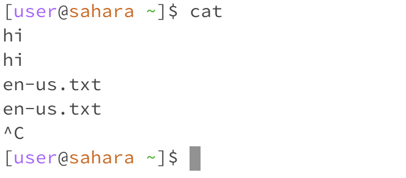
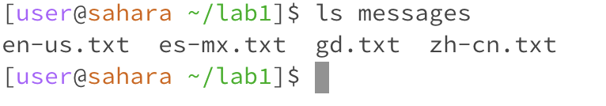
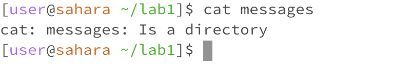

# Week 1: Lab Report #1  
Date: 10.02.23  
  
## Summary of Learning  
Thus far, we have been introduced to Github and four basic command line arguments  
- `cd` which changes the current working directory to a given path
- `pwd` which prints the current working directory
- `ls` which prints a list of of the files and folders in a given path
- `cat` which prints the contents of one or more files in the given path(s)

## Remote Access & FileSystem  
This portion contains examples of the commands `cd`, `ls`, and `cat` in use to illustrate their function.  
1. **Without any arguments**\
   When we type `cd` without any arguments, the current working directory is automatically changed to the root folder, which is */home* in this case. This is because when no path is specified, `cd` switches to the default directory, which is the root folder.\
   \
   When we type `ls` without any arguments, the files and folders in the current working directory is printed to the terminal. Like `cd`, when no path is specified, `ls` lists the contents of the default, which is the current working dirctory.\
   \
   When we type `cat` without any arguments, nothing is returned. If we try to type anything else, it will be copied back to us on terminal when we click enter, so that we have to click `ctrl+c` in order to be able to write commands again properly. This is because `cat` requires a file (from within the current working directory) path to be listed so that it can be printed to the console, therefore requires text to be entered after. Therefore, no error is thrown, and we can only start a new line by canceling the command.\
   \

2. **With a path to a directory as an argument**\
   When `cd` is used with a path to a directory as an argument, the current working directory is changed to the specified directory, *if the specified path can be found*. This means that the given directory path is either an absolute path, or a relative path to a file *within the current working directory*.\
   \
   Like `cd`, when the given directory path is either an absolute path, or a relative path to a file within the current working directory, `ls` will work. In this case, `ls` will list the directories/folders inside the path specified without changing the current working directory.\
   \
   `cat` will throw an error with a path to a directory as an argument, because this command prints the contents of files, and therefore expects files to be specified. The command does not work with merely a directory path as argument.\
   \
   
4. **With a path to a file as an argument**\
   When `cd` is used with a path to a file as an argument, an error is thrown that alerts us the path is not a directory. This is because `cd` is used to switch the current working directory we're in, which is not applicable to files.\
   \
   When `ls` is used with a path to a file as an argument, merely the file name will be returned. This is because files are the metaphorical end of the file structure - there is nothing nested inside them, so `ls` just returns the file name specified.\
   \
   When `cat` is used with a path to a file as an argument, the contents of the file is printed to the terminal. If multiple file paths are listed, it prints the contents of all the files. Finally `cat` works, because it's meant to be used on files!\
   
